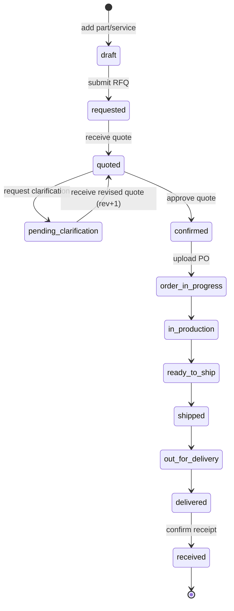

# Task 21 — Critical Journey 1: Equipment to quote to order to shipment tracking

- **Status:** Planned
- **Phase:** 3 — Transaction (critical journey integration)
- **Dependencies:** Task 05, Task 07, Task 08, Task 09, Task 10, Task 11

## Objective

Make the primary commercial journey work end to end as one connected flow so it can be tested: a user opens My Equipment, drills down the machine to find the right part and part number, adds it to the quote area, sends a quote request, receives the quote, approves it or rechecks it and sends another quote request, and once approved moves on to an order with full shipment tracking until the order is received. Buying a service follows the same journey; only the entry point differs (a service is added to the same quote area instead of a part).

## Context

This task integrates existing, currently disconnected pieces into a single journey. See `docs/requirements/solution-logic.md` sections 3.2 (one record lifecycle), 3.3 (discovery and transaction), and 3.5 (single status and next-action model), and `docs/design-guidelines/interaction-rules.md` for feedback, validation, and status rules.

Current problem (verified in code): the journey is split into three islands of local state.

- The equipment explorer "Add to quote" only sets a local visual flag and never reaches a cart (`src/features/equipment/machine-explorer.tsx`).
- Products & Services keeps its own local cart and only navigates away on submit (`src/features/products/products-and-services.tsx`).
- Quote & Order ignores what was submitted, renders static `quotes[0]` / `orders[0]`, uses a local three-step toggle, and has no shipment tracking (`src/features/quotes/quote-order.tsx`).

## Core idea: one object flows across the journey

There must be one shared transaction object that every page reads and updates through a React context at the app root. The user always acts on the same record while moving Equipment to Products to Quote to Order to Shipment.

```
Cart (basket)  ->  Quote Request  ->  Quotation  ->  Order  ->  Shipment  ->  Received
```

Parts and services are two kinds of line item in the same object. Buying a service is identical to buying a part; only the entry point differs.

## Lifecycle (single state machine)

| # | Status | Trigger (user action) | Guard / precondition | Next action shown |
|---|--------|-----------------------|----------------------|-------------------|
| 1 | `draft` | Add part/service to quote from Equipment or Products | item compatible | Review basket and submit request |
| 2 | `requested` | Submit quote request (RFQ) | basket not empty, all items compatible | Awaiting quotation from Emhart |
| 3 | `quoted` | Emhart returns quote | status was `requested` or `pending-clarification` | Review the quote: approve or request changes |
| 4a | `pending-clarification` | User rechecks and requests clarification (with note) | status `quoted` | Awaiting revised quotation |
| 4b | `quoted` (revision +1) | Emhart returns revised quote | status `pending-clarification` | Back to review, revision counter increments |
| 5 | `confirmed` (quote approved) | Approve quote | status `quoted` | Upload purchase order to place the order |
| 6 | `in-progress` (order) | Upload PO / place order | status `confirmed` | Order confirmed, track shipment |
| 7 | shipment sub-states | step-through | order exists | see shipment tracking section |
| 8 | `complete` (received) | Confirm receipt | status `delivered` | Order received, journey complete |

The clarification loop (4a to 4b) is the "recheck and send another quote request" step. Each pass increments a revision number and adds a timeline event so it is visible and testable.



## Shipment tracking sub-states

Once the order is confirmed, the order carries a shipment timeline. Each milestone has a status, timestamp, and where relevant a document placeholder link.

1. `order-confirmed` — PO accepted
2. `in-production` — parts being prepared, lead time running
3. `ready-to-ship` — packed, awaiting carrier
4. `shipped` — in transit (Bill of Lading / Air Waybill placeholder link)
5. `out-for-delivery` — arriving at site
6. `delivered` — arrived (POD placeholder link)
7. `received` — customer confirms receipt, journey ends

The current milestone drives the single next-action line in the record workspace.

## Architecture change

- Add a `TransactionProvider` context at the app root holding: `lineItems`, `status`, `revision`, `clarificationNotes[]`, `quoteTotal`, and `shipmentMilestones[]`.
- Equipment explorer and Products both call the same `addLineItem()`.
- Quote & Order reads and advances the same object instead of static data.
- Reuse the existing `Status` type (already includes `pending-clarification`, `quote-available`, `confirmed`, `delivered`, `complete`) and the existing `RecordWorkspace` timeline component.

## Open decision

How should Emhart's simulated responses (returning a quote, and returning a revised quote after clarification) be triggered so the flow can be tested?

- Option A (recommended): explicit demo buttons such as "Receive quote" and "Receive revised quote" to control timing and inspect each state deliberately.
- Option B: automatic after a short delay on submit; more realistic but harder to pause and inspect.

## Preconditions

- Equipment tree, part detail, services, and cart features exist.
- The shared record workspace and status vocabulary exist.
- The account scope and current machine context are available.

## Scope

In scope:

- Shared transaction context spanning Equipment, Products, Quote, and Order.
- Add-to-quote from both the equipment tree and the products view into the same basket.
- RFQ submission with compatibility guard.
- Quote review with approve and request-clarification actions.
- Clarification to revised-quote loop with a revision counter.
- Order creation via PO upload.
- Full shipment tracking timeline through to received.
- Service purchase through the same pipeline.

Out of scope:

- Real pricing, tax, or contract and invoice documents.
- Real carrier integration or live tracking.
- Persistence across reloads.

## Approach and assumptions

- Lift transaction state into a context provider at the app root.
- Replace local visual-only add-to-quote flags with real line-item additions.
- Drive Quote & Order entirely from the shared object.
- Keep discovery and transaction visually distinct but connected per solution logic 3.3.
- Follow interaction rules for success, validation, and status states.

## Deliverables

- `src/features/quotes/transaction-context.tsx` (or equivalent provider and hook).
- Updates to `src/features/equipment/machine-explorer.tsx` to add real line items.
- Updates to `src/features/products/products-and-services.tsx` to use the shared basket.
- A rebuilt `src/features/quotes/quote-order.tsx` driven by the shared object with shipment tracking.
- Any needed `src/data/portal-data.ts` shipment milestone and revision fields.

## Acceptance criteria

- [ ] A user can add a part to the quote area from the equipment tree.
- [ ] A user can add a service to the same quote area.
- [ ] Submitting an RFQ is blocked until all items are compatible.
- [ ] The user can receive a quote and either approve it or request clarification.
- [ ] Requesting clarification and receiving a revised quote increments a visible revision.
- [ ] Approving a quote enables PO upload and order creation.
- [ ] Shipment tracking advances through all milestones to received.
- [ ] The same object and status are shown consistently across pages.
- [ ] `npx tsc --noEmit` and `npm run build` pass.

## Plan and verification result

To be completed after implementation.
